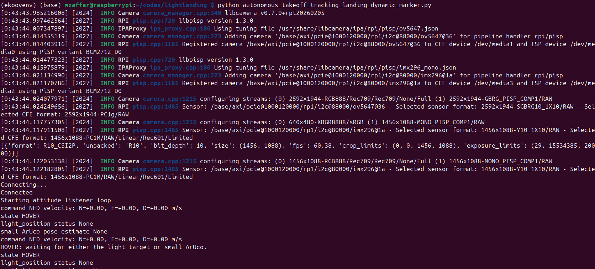

# LightLanding

Autonomous drone landing system for detecting and landing on a **light marker** or **ArUco marker** using a Raspberry Pi 5, PX4, MAVLink, and QGroundControl (QGC).

The Raspberry Pi runs the landing and vision software onboard the drone and communicates with the Ground Control Station (GCS) over a shared WiFi connection.

---

## System Overview

The setup consists of:

* **Drone / PX4 flight controller**
* **Raspberry Pi 5 (RPi 5)** onboard the drone
* **Ground Control Station (GCS)** laptop
* **QGroundControl (QGC)**
* **RC transmitter**
* **Light marker and/or ArUco marker**
* Laptop WiFi hotspot used for communication between the GCS and Raspberry Pi

The Raspberry Pi communicates with PX4 through:

```text
/dev/ttyACM0
```

at a baud rate of:

```text
921600
```

Telemetry is forwarded using `mavlink-routerd`.

---

# 1. Initial GCS–Drone Telemetry Setup

This setup should be performed when configuring a new GCS laptop.

> **Important:** During network configuration you may temporarily lose SSH access to the Raspberry Pi. Connect the RPi 5 directly to an LCD, keyboard, and mouse before starting. The password for this account on RPi5 has been privately communicated.

## 1.1 Connect the Raspberry Pi to the Laptop Hotspot

Turn on the WiFi hotspot on the GCS laptop.

Then connect the Raspberry Pi 5 to that hotspot.

On the Raspberry Pi, determine its current IP address:

```bash
hostname -I
```

Because this address may change over time, configure a static IP for the laptop hotspot connection.

---

## 1.2 Configure a Static IP

The expected network configuration is:

```text
Laptop / Gateway: 10.42.0.1
Raspberry Pi:     10.42.0.5
```

On the Raspberry Pi, run:

```bash
sudo nmcli connection modify "MyLaptopHotspot" \
    ipv4.method manual \
    ipv4.addresses 10.42.0.5/24 \
    ipv4.gateway 10.42.0.1 \
    ipv4.dns 10.42.0.1
```

Replace:

```text
MyLaptopHotspot
```

with the actual name of your laptop's hotspot connection.

After configuration, the Raspberry Pi IP should be:

```text
10.42.0.5
```

---

## 1.3 Configure SSH Access

From the GCS laptop, copy your public SSH key to the Raspberry Pi:

```bash
ssh-copy-id mzaffar@10.42.0.5
```

Password authentication is enabled on the Raspberry Pi for the initial key installation. The password has been privately communicated.

> **Security:** Do not store the Raspberry Pi password in this repository or README. Use SSH keys for normal access.

Test the connection:

```bash
ssh -X mzaffar@10.42.0.5
```

Both the laptop and Raspberry Pi must be connected through the laptop's hotspot.

If the SSH connection works, the system is ready for outdoor testing.

---

# 2. Outdoor Testing

## 2.1 Start the Network

Turn on the WiFi hotspot on the GCS laptop.

Power up the drone.

The Raspberry Pi should automatically connect to the laptop hotspot.

---

## 2.2 SSH into the Raspberry Pi

From the GCS laptop:

```bash
ssh mzaffar@10.42.0.5
```

---

## 2.3 Start MAVLink Routing

Check the IP address of the laptop (assuming here it is 10.42.0.1). On the Raspberry Pi, run:

```bash
mavlink-routerd /dev/ttyACM0:921600 -e 10.42.0.1:14550
```

This streams MAVLink data between QGroundControl and PX4.

PX4 is connected to the Raspberry Pi through:

```text
/dev/ttyACM0:921600
```

---

## 2.4 Start QGroundControl

Launch **QGroundControl (QGC)** on the GCS laptop.

Verify that telemetry from the drone is visible in QGC before continuing.

---

# 3. Run LightLanding

Open another terminal on the laptop and connect to the Raspberry Pi with X forwarding:

```bash
ssh -X mzaffar@10.42.0.5
```

Navigate to the project:

```bash
cd /home/mzaffar/codes/lightlanding/
```

Activate the Python virtual environment:

```bash
source ekoovenv/bin/activate
```

Run the autonomous landing program:

```bash
python autonomous_takeoff_tracking_landing_dynamic_marker.py
```

Startup logs should begin appearing within approximately **2–3 seconds**.

During operation, the SSH terminal keeps one compact status line updated with
the mission state, light and ArUco ranges, lateral centering, and platform
tilt. Connection, state-transition, safety, and landing messages are printed
only when they occur. Detailed control samples and telemetry remain in the
JSONL files under `~/logs`.



---

# 4. Flight Test

> **Warning:** Autonomous flight testing can cause injury or equipment damage. Perform tests in a suitable outdoor area with appropriate safety procedures and maintain the ability to terminate autonomous behavior.

Turn on the RC transmitter. It should connect to the drone automatically.

Verify RC communication before flight by checking controls such as:

* Mode switch
* Kill switch
* Other required RC controls

Then:

1. Switch the drone to **Position Mode**.
2. Disengage the kill switch.
3. Arm the drone.
4. Fly the drone close to the landing marker.
5. Allow the vision system to detect the marker.

When the drone detects either the **light marker** or **ArUco marker** for the configured stable detection period, it will enter **Offboard Mode** and attempt to land on the marker.

---

# 5. Configuration

Landing behavior and vision parameters can be modified in:

```text
/home/mzaffar/codes/lightlanding/landing_config.py
```

Logs are stored in:

```text
/home/mzaffar/logs/
```

Important configuration parameters include the following.

## `ENABLE_LIGHT_MARKER`

Controls light-marker detection.

Use this to enable or disable light-marker detection depending on the experiment, particularly for different day/night conditions.

---

## `SHOW_VISUALIZATION`

Enables the vision visualization used to inspect light-marker and ArUco detection.

For good light-marker detection, the threshold image should ideally show the lights as:

* Clearly separable blobs
* Approximately similar in radius
* Without holes inside the blobs
* Without distracting surrounding blobs

If the lights are not visible in the threshold image, decrease:

```python
BRIGHTNESS_THRESHOLD
```

If irrelevant objects or regions are appearing as blobs, increase:

```python
BRIGHTNESS_THRESHOLD
```

---

## `ENABLE_AUTONOMY`

Enables or disables autonomous landing behavior.

> **Important:** When autonomy is enabled, disable `SHOW_VISUALIZATION`.

```python
ENABLE_AUTONOMY = True
SHOW_VISUALIZATION = False
```

Visualization slows down the vision thread. Running it during autonomous operation can therefore cause the drone to act on outdated vision information.

---

## Notes

The landing system supports both **light-marker** and **ArUco-marker** detection. Detection behavior, visualization, thresholds, and autonomous landing can be adjusted through `landing_config.py`.

During development, visualization can be useful for tuning the detector. During autonomous flight, visualization should be disabled to avoid slowing the vision thread and introducing stale information into the control loop.

You can record the camera data using the following. Camera 0 is RGB and camera 1 is monochrome.

```bash
rpicam-vid --camera 0 -t 0 -o recoding_cochstedt.h264
```
